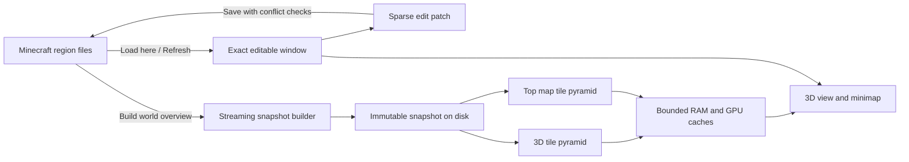

> Исторический материал. Текущие требования: [план](../../structura-edit-roadmap.md) и [архитектура](../../structura-edit-architecture.md).

# Чанки и обзор всего мира: исследование и план

Дата: 11 сентября 2026. Архив исходного исследования, аудита и плана до реализации. Реализация начата; актуальные решения и отличия находятся в [сводке](chunk-rendering-decisions.md) и [правилах навигации](world-navigation-plan.md). Таблицы «сейчас» ниже описывают состояние до изменений; базовые замеры сохранены для сравнения.

Уточнено после проверки дополнительных рекомендаций. Короткая актуальная сводка плюсов, минусов и причин выбора — [chunk-rendering-decisions.md](chunk-rendering-decisions.md). Полёт, телепорт и автоматическое уточнение после остановки — [world-navigation-plan.md](world-navigation-plan.md).

## Рекомендация

Для Structura выбираю **компактную точную область редактирования, разреженный патч изменений и неизменяемый снимок всего мира на диске с готовыми пространственными HLOD-мешами**. 3D-обзор и Top map используют один снимок. RAM и GPU содержат ограниченную рабочую выборку.

Нынешняя основа разумна: секционные меши, удаление внутренних граней, локальное обновление, фоновый процесс, ограниченные кэши и сохранение патчем. До хорошего баланса мешают дублирование представлений блоков, дорогие копии и передача больших документов. Увеличением радиуса это не исправить.

Для новой функции выбрана иерархия готовых объёмных представлений с полигональным упрощением meshoptimizer/QEM. Ранний прототип проверяет качество и стоимость выбранного пути; воксельное упрощение остаётся резервом при подтверждённой проблеме, без одновременного развития двух builder. Прежнее предпочтение воксельной пирамиды пересмотрено. Однослойная карта высот не удовлетворяет требованию узнаваемых мостов, навесов, полых построек и свободного полёта. Это уточняет и заменяет раздел о будущем heightfield-обзоре в [предыдущем плане](world-distance-plan-2026-09-11.md).

**Почти незаметные переходы — проверяемая цель, а не гарантированное свойство любого LOD.** Сначала нужен небольшой работающий прототип качества и производительности на текущем Qt/VTK. После его проверки можно фиксировать формат производных данных и строить весь мир.

## Что показали код и замеры

Проверен путь `world → document/session → render_source → sections → preview → scene`, а также worker, Save и карты.

| Участок | Сейчас | Решение |
|---|---|---|
| Чтение мира | Каждый чанк открывает region-файл; декодированные блоки попадают в словарь координат | Читать region-файлы последовательно, выдавать секции массивами |
| Блоки в памяти | Миллионы ключей `(x, y, z)` и Python-объектов | Для ограниченного окна мира — палитра и `int32`-массив; NBT отдельно |
| Подготовка геометрии | Словарь → большой массив → словари секций → массивы mesher | Передавать числовые окна напрямую, с ореолом соседей |
| Правки | Общая база и разреженные изменения; накопленный патч копируется при применении | Сохранить модель; индексировать затронутые секции, если профиль подтверждает цену большого патча |
| Save | Корректная запись патча, но подготовка создаёт полный снимок и новый Document | Сократить подготовку и обмен, сохранить проверки конфликтов и резервирование |
| Геометрия | Модели блоков, отсечение скрытых граней, группы 16³/32³ | Сохранить; для крупных сцен оставить 32³ исходным значением |
| Кэш мешей | 96 MiB; хешируется источник с общей палитрой | Ключ по содержимому секции, соседям и реально используемым ресурсам |
| Обмен с worker | Pickle больших сессий в обе стороны | Сначала компактные данные и маленький запрос Save; общий shared-memory runtime пока не нужен |
| Миникарта | Ограниченные тайлы проекций текущего высотного окна | Полная Top map из снимка; существующие Slices сохраняют свою семантику |

Конкретные места: [world_io.py](../../../../structura-core/src/structura_core/world_io.py), [world_chunks.py](../../../../structura-core/src/structura_core/world_chunks.py), [render_source.py](../../../src/structura_edit/render_source.py), [world_view.py](../../../src/structura_edit/world_view.py), [world_changes.py](../../../src/structura_edit/world_changes.py), [jobs.py](../../../src/structura_edit/jobs.py), [section_cache.py](../../../src/structura_edit/section_cache.py). Это выводы чтения кода; долю каждого участка в полном времени ещё нужно подтвердить отдельным профилем.

Новые базовые прогоны выполнены в видимом native Qt, на временных копиях мира `A`, viewport 2760 × 1602. Результаты сохранены в [evidence JSON](world-overview-plan-2026-09-11.evidence.json).

| Метрика | Радиус 6 | Радиус 8 |
|---|---:|---:|
| Загруженных блоков | 1 068 043 | 1 887 782 |
| Open | 6,25 с | 10,04 с |
| Первый Refresh | 5,48 с | 9,95 с |
| Повторный Refresh | 2,70 с | 5,03 с |
| Save одной правки | 1,77 с | 3,37 с |
| Завершённых отрисовок/с в полёте | 86,0 | 40,3 |
| p95 интервала между завершёнными кадрами | 16,5 мс | 82,2 мс |
| Максимальный интервал GUI-таймера на Save | 115 мс | 263 мс |
| RSS GUI + worker после Save | 2,13 GiB | 2,97 GiB |
| Акторов / данных геометрии | 183 / 41,8 MiB | 310 / 70,0 MiB |

Это по одному прогону с трёхсекундным полётом, без профайлера. Значение отрисовок/с не равно частоте физического дисплея. RSS измерен в конце этапа, не на пике, и может повторно учитывать общие страницы. Эти числа подтверждают проблему масштабирования, но не доказывают скорость предлагаемой архитектуры.

В Overworld мира `A` каталог region-заголовков содержит **2 601 существующую колонну чанков в четырёх region-файлах**. Для полного мира это полезный первый сценарий проверки. Количество относится к этому измерению, не к Nether/End.

Один `int32`-индекс занимает 4 байта: миллион ячеек — около 4 MiB, действующий предел 8 млн — около 30,5 MiB. Это только массив индексов, без NBT, палитры, мешей, временных копий и остальных процессов. Полную экономию RAM нужно измерять на приложении.

## Какие практики подтверждены источниками

| Источник | Что изучено | Что применимо здесь |
|---|---|---|
| [Amulet: Blocks](https://amulet-core.readthedocs.io/en/stable/api_reference/api/chunk/blocks.html) | Секции чанков представлены NumPy-массивами; существующие секции перечисляются отдельно | Палитра + числовые секции вместо объектов для каждой координаты |
| [Voxel Tools: blocky terrain](https://voxel-tools.readthedocs.io/en/latest/blocky_terrain/) | Mesher собирает модели блоков в чанки и отсекает внутренние грани, без greedy meshing | Текущий универсальный mesher соответствует известной практике; его не нужно полностью заменять |
| [Voxel Tools: performance](https://voxel-tools.readthedocs.io/en/latest/performance/) | Размер чанка меняет баланс draw calls и цены обновления; установка мешей ограничивается временем кадра | Сохранить разумный размер групп и ограничивать работу GUI |
| [Distant Horizons: релиз 2.1.0a](https://gitlab.com/distant-horizons-team/distant-horizons/-/releases/2.1.0a) | Уменьшение памяти и размера БД, исправления полых структур при downsampling, прозрачности и вертикальных LOD | Отдельные визуальные данные работают, но выбор представителя и материалов требует проверки |
| [DH server plugin: релиз 0.5.0](https://gitlab.com/distant-horizons-team/distant-horizons-server-plugin/-/releases/0.5.0) | Есть быстрый поверхностный builder и полный builder с обходом блоков и метаданными; LOD сохраняются между запусками | Для требуемого качества строить из полной высоты; поверхностную выборку использовать для 2D |
| [DH: описание хранения](https://gitlab.com/distant-horizons-team/distant-horizons/-/wikis/2-frequently-asked-questions/1-general/General/diff?version_id=bf55a6265432c6e09c9bf221cc981b2ef31af1c6&w=0) | Сохранённые LOD в SQLite, раздельно по измерениям | Снимок на диске и явная идентичность измерения |
| [Voxy: WorldSection](https://raw.githubusercontent.com/MCRcortex/voxy/dev/src/main/java/me/cortex/voxy/common/world/WorldSection.java) | Исходный код секций 32³ с числовыми данными и координатами уровня | Регулярные объёмные тайлы — рабочая основа LOD, без обязательного собственного графа объектов |
| [Voxy: Mipper](https://raw.githubusercontent.com/MCRcortex/voxy/dev/src/main/java/me/cortex/voxy/common/world/other/Mipper.java) | При уменьшении 2³ ячеек выбирается непрозрачный представитель с позиционным приоритетом | Это эвристика с потерями, а не доказательство незаметности любого уменьшения |
| [Voxy: официальная страница](https://modrinth.com/mod/voxy) | Есть импорт сохранённого мира; мод требует OpenGL 4.6 | Предварительный импорт соответствует задаче; его специализированный renderer не является готовым компонентом для нашего VTK |
| [Cesium Native: выбор тайлов](https://cesium.com/learn/cesium-native/ref-doc/selection-algorithm-details.html) | Выбор по экранной ошибке, ограниченные загрузки, сохранение доступного покрытия при уточнении | Дальность LOD зависит от изображения и готовности замены, а не только от номера кольца |

Источники DH с номерами 2.1.0a и 0.5.0 — исторические инженерные решения 2024 года, не заявление об актуальных версиях. Изучены официальные описания и опубликованные материалы DH, а у Voxy — также указанные исходные файлы. Полный аудит внутреннего ядра DH не проводился. Ссылки Voxy на ветку `dev` могут меняться; перед реализацией зафиксировать ревизию в документации.

Greedy meshing полезен для совместимых плоских граней, но его цена включает UV, повторение текстур, освещение и границы материалов. Это подробно разбирает автор алгоритмического обзора: [meshing](https://0fps.net/2012/06/30/meshing-in-a-minecraft-game/), [атласы и mipmapping](https://0fps.net/2013/07/09/texture-atlases-wrapping-and-mip-mapping/). В ранний эксперимент входит greedy для полных непрозрачных граней вместе с правильным повторением текстур. Специальные модели сохраняют текущий путь. Для одноцветных граней грубого LOD объединение проще. Уменьшение числа граней оценивается вместе с временем кадра, ценой пересборки и сложностью интеграции.

## Почему выбран именно этот компромисс

| Подход | Качество и стоимость | Решение |
|---|---|---|
| Все точные чанки одновременно в RAM/GPU | Простая идея, стоимость растёт с размером мира | Не масштабируется до задачи |
| Одна поверхность высот | Компактно, удобно для Top map; теряются объёмные структуры | Использовать для 2D, не как общий источник 3D |
| Несколько вертикальных интервалов в колонне | Сохраняют больше геометрии, но добавляют особые правила слияния по вертикали | Резервный вариант; не разрабатывать третью систему в первом прототипе |
| Регулярные объёмные тайлы с редукцией вокселей | Единая пространственная модель, но теряются тонкие детали и нужны переходы разрешений | Резерв при подтверждённой проблеме выбранного пути |
| HLOD готовых мешей с QEM | Готовый алгоритм для произвольных поверхностей; ограничения UV, топологии и границ | Выбран meshoptimizer; проверить прототипом, собственный QEM не писать |

Моя инженерная рекомендация опирается на эти практики, но конкретная комбинация ещё должна пройти проверку в Structura. Успех модов на собственном GPU-движке не доказывает те же FPS на VTK.

## Устройство данных и жизненный цикл



### Точная область редактора

База загруженного окна — принадлежащий документу числовой массив; изменения остаются отдельным патчем. Палитра, NBT блоков и сущности хранятся отдельно. Совместимость `Structure.present` сохраняется небольшим адаптером стандартного Mapping-контракта; существующие разреженные структуры не нужно принудительно уплотнять.

Нулевой индекс палитры является обычным значением. Отсутствующее значение массива и неизвестный чанк — разные понятия: доступность колонн хранится явно. Копирование NBT и независимость preview/Undo должны остаться корректными.

Mesher получает числовое окно с соседями. Обычные NumPy-срезы могут разделять память, поэтому граница владения должна быть явной: база неизменяема, модифицируемый рабочий буфер копируется. Автоматический copy-on-write и собственный allocator здесь не требуются. [NumPy: copies and views](https://numpy.org/doc/stable/user/basics.copies.html).

Для Save передавать путь, патч, изменения сущностей и идентификатор ревизии вместо полного документа там, где обработчик этого не требует. После подтверждённой записи обновлять базу одним понятным действием. Сохранить повторное чтение изменяемых чанков, обнаружение конфликтов, безопасную установку и Backup. Физическая запись Anvil всё равно может копировать region-файл; обещать стоимость Save строго пропорционально одному блоку нельзя.

### Снимок всего мира

Кнопка обходит все реальные region-файлы мира и существующие записи чанков. Обрабатывать измерения раздельно, показывать выбранное измерение; одинаковые координаты Nether и Overworld не объединять. Отсутствующие чанки не генерировать и не превращать в известный воздух.

Порядок: каталог → последовательное чтение небольшими пакетами → запись точных секций → построение и запись мешей уровней и карт → проверка → публикация поколения. Чтение использует общий decoder core, включая поддерживаемые старые форматы и внешние `.mcc`. Для full-world прохода region-файл открывается на пакет чанков. Глобальный прямоугольный массив мира не создаётся: между двумя далёкими постройками могут быть миллионы пустых координат.

Для хранения достаточно SQLite с пакетными транзакциями и сжатыми числовыми буферами, без новой зависимости для базы. Хранить координаты и покрытие, палитры состояний, полную доступную высоту, готовую геометрию, данные внешнего вида, необходимые NBT, версии формата/ресурсов и отпечатки источников. Повторяющиеся изображения ресурсов сохранять по общему ключу, не вместе с каждой копией меша. Данные для цветов и затенения выбираются по принятому стилю; введение Minecraft-lightmap или fullbright не является обязательной частью LOD. Точный и дальний renderer используют согласованные правила. Визуальные сущности, которые уже поддерживает редактор, нужно включить в проверку ближнего уровня снимка; дальние динамические сущности не являются частью terrain LOD.

Готовые поколения неизменяемы. Неполный результат находится отдельно; указатель на текущее поколение меняется только после закрытия записи и проверки, с повторным использованием [local_store.py](../../../src/structura_edit/local_store.py). Транзакции SQLite обеспечивают целостность внутри базы; публикация файлового поколения — отдельная ответственность. [SQLite: atomic commit](https://sqlite.org/atomiccommit.html).

Отмена, нехватка места, повреждённый чанк или ошибка не заменяют предыдущий полный обзор. При ошибках чтения первая версия сохраняет старый обзор и показывает число проблем с Details; частичный результат не выдаётся за весь мир. Изменение исходников во время обхода проверяется по отпечаткам и согласованности чтения. Это не атомарный снимок активно записываемого Minecraft-мира: при обнаруженном изменении требуется повторный Refresh.

Кэш расположен в данных Structura, отдельно от сохранения Minecraft. Активный снимок закреплён: его точные исходные тайлы и готовые меши уровней нельзя поштучно удалять обычным LRU. Ограничивать и вытеснять можно декодированные данные, GPU-ресурсы, дополнительные неактивные слои карты и старые поколения. Перед большой сборкой учитывать место и для старого, и для нового поколения, включая подготовленную геометрию. При повреждении активного кэша требуется явный Rebuild; повторный meshing из-за обычного вытеснения RAM/GPU недопустим.

### Что меняется при движении камеры

Minecraft-файлы читаются при Build/Refresh и обычных явных действиях загрузки редактора. Полёт выбирает **готовые меши снимка**, читает и распаковывает их, загружает в GPU при необходимости. Повторный meshing неизменившихся секций при обычном полёте не запускается. Так сохраняются статичность источника и возможность приблизиться к любой уже импортированной постройке без постоянного хранения всего мира в памяти. Цена — больший объём дискового снимка и первоначальной сборки.

Подробности новой области автоматически запрашиваются после короткой остановки камеры или завершения жеста карты; начальная пауза 350 мс. Во время движения сохраняется готовое покрытие, минимально необходимые грубые ресурсы имеют приоритет. Телепорт готовит вид назначения до согласованной смены камеры и сцены. Рабочая область документа остаётся закреплённой до `Load here`; автоматическая визуальная детализация не меняет выбор, историю и патч. Зум карты не двигает 3D-камеру. Полная политика, отмена и проверки описаны в [плане навигации](world-navigation-plan.md).

Очередь ограничена: актуальная цель камеры заменяет устаревшую; число одновременно читаемых и подготовленных тайлов ограничено байтами и количеством. Поколение снимка и ревизия запроса проверяются перед установкой. Пока замена не готова, остаётся старое корректное покрытие.

Сборка мира выполняется одним отдельным процессом, чтобы длительный импорт не занимал единственный worker редактирования. Прогресс передаёт только маленькие сообщения; результат — идентификатор снимка. Чтение готовых тайлов имеет отдельную ограниченную очередь. Завершение процесса и очистка staging не должны блокировать GUI; не добавлять пул по процессу на чанк.

## Качество 3D и миникарты

**LOD0:** точные блоки и существующие модели/текстуры из снимка. Он доступен и снаружи редактируемого окна, но сам по себе не включает редактирование.

**Следующие уровни:** готовые меши групп соседних секций. Начальный кандидат разбиения — регулярная объёмная иерархия с листьями 32³ блоков и увеличением размера области вдвое. Хранение по ключу `(dimension, level, x, y, z)`; связи вычисляются арифметически. Формат содержит bounds, меши, ошибку относительно точного источника и версии зависимостей. Число уровней определяется реальными границами данных. Это не требует дерева Python-объектов или ручного менеджера памяти. При выборе воксельного builder его отсчёты также могут быть 32³ с масштабом ячейки 2, 4, 8…; числовая сетка упрощения не является контрактом renderer.

Грубое представление сохраняет допустимые геометрию и внешний вид. Для QEM подготовить связность меша, правила атрибутов и защищаемые границы; накопленную ошибку последовательных упрощений учитывать относительно LOD0. Для воксельного варианта выбирать покрытие и внешний вид, а не среднее palette ID. В обоих случаях разделять непрозрачность, alpha mask и воду/прозрачность. Цвета получать из общих ресурсов; усреднение выполнять с корректной обработкой alpha и цветового пространства. Мелкую текстуру заменять цветом только там, где её потеря достаточно мала на экране. Если эвристика убирает заметный мост или крышу, тайл сохраняет более подробный уровень.

Выбор уровня учитывает размер viewport, FOV, расстояние до границ тайла и оценку геометрической ошибки. Для перспективы исходная оценка: `error_px ≈ error_world × viewport_height / (2 × distance × tan(FOV_y / 2))`. Для ортографической камеры используется масштаб проекции. Начальный исследуемый порог — 1–2 физических пикселя, с разными порогами уточнения/огрубления, чтобы уровень не дрожал. Геометрическая ошибка не измеряет цвет и исчезновение тонких деталей: нужны дополнительные проверки внешнего вида и сравнение с точным эталоном.

Строгий пиксельный порог может потребовать слишком много точных мешей. Прототип должен показать достижимый баланс; превышение бюджета нельзя молча скрывать резким падением качества. Отдельно измерять геометрию, число акторов, загрузку ресурсов и прозрачность. Совместимые материалы объединять внутри ограниченных пространственных групп, сохраняя отсечение и локальную замену.

**Стыки — обязательный результат прототипа.** У полигонального кандидата исходные пространственные границы должны совпадать и сохраняться на соседних уровнях; топологические края и плоскости границ тайлов — разные понятия. QEM с большим весом края не заменяет строгий договор о его сохранении. У воксельного кандидата проверять соседние уровни с разницей максимум вдвое и покрытие общей плоскости в более мелкой сетке, с однозначным владельцем грани. Одна только разница уровней ≤ 1 не гарантирует отсутствие щелей. Переходы должны быть подготовлены заранее; зависимая от камеры генерация стыков нарушает выбранный режим, а хранение всех комбинаций соседей может оказаться слишком дорогим. Ступени, модели, вода и край точного окна требуют отдельных примеров. Уточнение публикуется с готовыми необходимыми границами, сохраняя покрытие.

Готовый Transvoxel решает переходы для поверхностей Marching Cubes; перенос его таблиц не является готовым решением для Minecraft-моделей с жёсткими гранями. Это видно из [описания алгоритма автором](https://transvoxel.org/). Туман, прозрачное наложение и вертикальные «юбки» не принимаются за исправление геометрических дыр. Дополнительное плавное переключение рассматривается только после корректных границ и измерения цены прозрачности.

В точной области показывается текущий документ с его несохранёнными правками. Он перекрывает снимок только в реально загруженном объёме; нельзя вырезать целую колонну, когда редактор загрузил лишь её часть по Y. Граница перекрытия обновляется при явной загрузке/правке. Picking и операции ограничены точными редактируемыми данными. При изменении среза нужны точные данные: GPU-clipping готового меша не создаёт отсутствующие поверхности разреза, а грубый LOD способен потерять внутренние детали. Не обещать произвольный точный срез всего мира только из наружных мешей. Для дальних координат проверить локальные координаты мешей, перенос начала отсчёта камеры и точность depth buffer.

**2D:** из точных данных снимка строится отдельная пирамида растровых Top-тайлов. Нельзя просто отрендерить верх грубого 3D LOD: редукция способна потерять тонкую постройку. Миникарта и большая карта выбирают разрешение по масштабу; панорамирование использует готовые тайлы. Неизвестное покрытие имеет явное обозначение. Текущие шесть проекций/Slices остаются срезами локального документа. Полноразмерное изображение на весь bounding box мира не выделяется.

Для Nether Surface включает настоящий потолок; внутренний обзор использует явно выбранный фиксированный `Below Y`/срез. Потолок и постройки над ним сохраняются в снимке. Для End отдельно проверять нижние поверхности островов и известную пустоту между ними. Custom dimensions используют реальные секции и метаданные высоты/потолка; logical height не ограничивает импорт. Параметры измерения не заменять общими константами Overworld. Дополнительный Y-слой строится по явному выбору из снимка, без предварительной растеризации всех возможных высот.

Мерцание текстур проверять независимо от LOD: сейчас `scene_geometry.py` отключает mipmaps, а атласное повторение требует корректного фильтрования. Общие неизменяемые изображения должны переиспользоваться на CPU/GPU, где это поддерживает backend. Настоящая 3D-миникарта может использовать те же данные и меши с собственной камерой и выбором видимости; совместное использование GPU-ресурсов между контекстами проверяется отдельно. Дополнительный вид не является второй копией мира и всё равно требует отдельной отрисовки.

## Кнопка и загрузка

Кнопка **Build world overview** находится рядом с действиями мира; после первой сборки — **Refresh overview**. Включение **Show overview** и действие **Fit world** доступны отдельно. Завершение сборки сохраняет камеру; весь мир можно кадрировать явным Fit world.

Небольшая немодальная панель поверх viewport, Monocraft, квадратная рамка 1 px, сетка 4 px и высота кнопок по общей теме. Полоса прогресса зелёная, сегментированная, в духе полосы опыта Minecraft. Фиксированная ширина чисел и панели сохраняет раскладку. Все надписи английские.

```text
World overview                         Cancel
Reading chunks · Overworld
[██████████████░░░░░░░░]                 70%
1,824 / 2,601 chunks                  Details
```

Стадии: **Finding chunks → Reading chunks → Building detail levels → Building map → Finishing**. Процент относится к явно названной стадии. До известного количества — индикатор работы без выдуманного процента. Qt поддерживает это штатно через диапазон `0, 0`. [QProgressBar](https://doc.qt.io/qt-6/qprogressbar.html).

Обновления панели достаточно отправлять 5–10 раз/с, сохраняя существующий верхний предел 20. Счётчики завершённых чанков/тайлов точные; ETA добавляется только после измеренной устойчивой скорости. На первом запуске редактор остаётся доступным, полный обзор появляется после публикации снимка. При Refresh предыдущий обзор виден до успешной замены. На ошибке — короткая полная причина, Details и Retry.

**Refresh overview** сначала сверяет каталог: новые, удалённые и изменённые чанки. Изменившиеся источники перечитываются; перестраиваются зависимые тайлы, соседние границы, предки LOD и карты. Быстрые отпечатки файлов не равны содержимому: правила проверки и принудительного полного пересканирования должны быть явными. Save помечает соответствующую часть снимка устаревшей; обновление самого снимка пока выполняется кнопкой. Локальный документ продолжает показывать правки сразу.

## Порядок реализации и условия готовности

| Этап | Изменения | Чем заканчивается |
|---|---|---|
| 0. База сравнения | Текущие r6/r8; добавить длинный маршрут и профиль CPU/обмена/установки | Воспроизводимый отчёт; короткие исходные прогоны уже сохранены |
| 1. Компактные точные данные | core: массивы и пакетное чтение; render: числовой вход; edit: адаптация Document/RenderSource, ключей кэша и Save | Совпадают блоки, NBT, Undo/Redo и сохранённый мир; измерены Open/Refresh/Save/RSS до и после |
| 2. Прототип геометрии | Greedy/текстуры для полных кубов; QEM через meshoptimizer; вода, стыки и выбор по экрану | Сравнение с точной сценой и полёт; подтверждены качество выбранного builder, бюджет и цена интеграции |
| 3. Полный снимок | Каталог всех измерений, потоковый builder, SQLite, прогресс/отмена, публикация поколений | Все реальные чанки учтены; отмена/ошибка оставляют старое поколение; память ограничена |
| 4. Просмотр 3D/2D | Кэш готовых тайлов, уточнение после остановки, ограниченная публикация, покрытие карты и зум | Полёт работает по готовым ресурсам; нет Minecraft-I/O и повторного meshing неизменившихся секций |
| 5. Интерфейс и Refresh | Build/Refresh, Auto detail, подготовка телепорта, Fit world, измерения и отмена устаревших целей | Полный цикл Build → Fly/Zoom → Refine → Go here → Load here → Save → Refresh |
| 6. Приёмка | Длинные native-прогоны, проверки сложной геометрии, рост размера мира, документация | Подтверждены качество, границы ресурсов и отсутствие регрессий редактора |

После этапа 2 принимается техническое решение по renderer. Если VTK не выдерживает согласованное качество даже с ограниченными тайлами и объединением материалов, нужно пересмотреть способ рисования до полного builder/UI. Автоматическая замена всего графического движка не входит в этот план. Прототип не считается готовой пользовательской функцией.

Границы ответственности: **core** — чтение, каталог чанков, числовые данные и сохранение патча; **render** — редукция, меши, материалы, геометрическая ошибка; **edit** — хранение снимков приложения, фоновые задания, выбор видимых данных и UI. Общие операции доступны Python API без GUI. Добавлять небольшие связные модули по этим обязанностям; не расширять `world_view.py` или `ui.py` до универсального менеджера мира. Константы и политики бюджетов хранить в одном месте. Объяснения — здесь, код без комментариев, с точными именами.

## Проверки, которые определяют успех

**Корректность данных:** существующие/отсутствующие/пустые чанки, отрицательные координаты, разрывы карты, полная высота, поддерживаемые версии Anvil и `.mcc`, независимые измерения, NBT и палитра, изменение мира во время чтения. Для правок — создание/удаление на границе секции, отмена, повтор, конфликты Save и сохранение чужих изменений в том же чанке.

**Качество:** плоскость, лестница, крыша толщиной в блок, узкий мост, полая башня, арка/пещера, лес, стеклянная постройка, вода у берега, waterlogged-блоки, Nether и End. Камера пересекает границы уровней и точной области, останавливается около порога и быстро разворачивается. Сравниваются фиксированные кадры с LOD0 и видео движения: силуэт, отверстия, цвета, вода, мерцание и изменение деталей. Малой средней ошибки изображения недостаточно, если пропала заметная конструкция.

**Производительность:** минимум три независимых прогона до/после на одном мире, ресурсах, камере и viewport. Полёт 30–60 секунд; профилирование отдельно. Записывать медиану Open/Refresh/Save, p95/p99 кадров и задержек GUI, время установки мешей, пик RSS всех процессов, байты CPU/GPU-кэшей, акторы/грани, холодную сборку и повторное открытие снимка. Отдельный тест увеличивает число далёких чанков при неизменном видимом фрагменте: оперативная память должна выходить на предел кэша, а не расти с миром.

Начальные цели для настройки, **пока не подтверждённые результаты**: 60 FPS на согласованном маршруте с p95 интервала кадра до 25 мс; установка геометрии порциями примерно 2–4 мс; реакция панели на Cancel до 100 мс. Отдельный тяжёлый меш не должен бесконтрольно превышать бюджет порции. Рабочий RAM-кэш обзора начать проверять с 256 MiB, GPU-геометрию — со 128 MiB; учитывать также меши точной области, staging и временные буферы. Если точность не помещается в этот бюджет, параметры выбираются по результатам прототипа, а не объявляются универсальным стандартом.

Проверить отсутствие Minecraft-I/O и meshing при обычном полёте счётчиками вызовов; чтение и распаковка готовых ресурсов при промахе RAM-кэша допустимы. Проверить независимость двух видов, корректность покрытия/цвета пирамиды и совпадение инкрементального Refresh с полной сборкой. После простоя редактор сохраняет отрисовку по запросу. В GUI проверить узкое окно, Retina, длинные числа, переключение приложений, отмену, закрытие окна во время сборки и повторный запуск после ошибки.

Работу считать законченной после прохождения этих условий, а не после появления кнопки или первого далёкого рельефа. Основной риск — совместить малозаметное упрощение с бюджетом текущего renderer; именно поэтому он проверяется ранним ограниченным прототипом.
